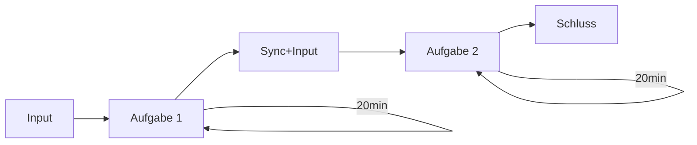

# D3-Workshop: Updates, Transition and Motion

im Modul "Visualisierung" im Medieninformatik Master and der TH Köln.

Bei Fragen gerne melden bei:

- Finn Gedrath ([@finnge](https://github.com/finnge))
- Julian Hardtung ([@JuHardtung](https://github.com/JuHardtung))

## Workshop-Ablauf

