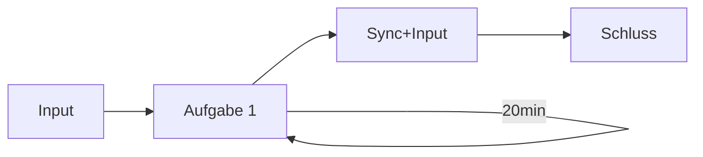

# D3-Workshop: Updates, Transition and Motion

im Modul "Visualisierung" im Medieninformatik Master an der TH Köln.

Bei Fragen gerne melden bei:

- Finn Gedrath ([@finnge](https://github.com/finnge))
- Julian Hardtung ([@JuHardtung](https://github.com/JuHardtung))

## Workshop-Ablauf

## Aufgabe

> Wissen für die Aufgabe gibt es [`wissen/transition/README.md`](https://github.com/finnge/vi-updates-transition-motion-workshop/tree/main/wissen/transition) und [`wissen/update/README.md`](https://github.com/finnge/vi-updates-transition-motion-workshop/tree/main/wissen/update)

1. Repository klonen
2. In VSCode öffnen und [LiveServer](https://marketplace.visualstudio.com/items?itemName=ritwickdey.LiveServer) starten. \
*(Alternativ kann ein anderer lokaler Server genutzt werden oder Datei aus dem Datei-System öffnen `file://`)*
3. Aufgabe öffnen: [localhost:5001/aufgabe/index.html](http://localhost:5001/aufgabe/index.html)
4. Bearbeiten der Aufgabe in einer beliebigen IDE

> AUFGABEN
> 1. x and y values that are higher than in the current DATASET should be displayed within the chart
> 2. the new values for circles should be updated with a transition (you can play around with duration and delay)
> 3. during the update transition the size and color of the circles should be changed
> 4. the xAxis and yAxis should be updated with a transition as well
