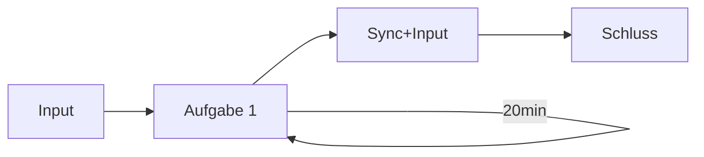

# D3-Workshop: Updates, Transition and Motion

im Modul "Visualisierung" im Medieninformatik Master an der TH Köln.

Bei Fragen gerne melden bei:

- Finn Gedrath ([@finnge](https://github.com/finnge))
- Julian Hardtung ([@JuHardtung](https://github.com/JuHardtung))

## Workshop-Ablauf

## Aufgabe

> Wissen für die Aufgabe gibt es in `wissen/transition/README.md` und `wissen/update/README.md`

1. Repository klonen
2. Lokalen Pfad zur Aufgaben-HTML im Browser öffnen (-> file:///*"euer Pfad"*/vi-interaction-workshop/handson/aufg1/index.html)
    - *ein lokaler Webserver wird nicht benötigt, da keine lokale Datei mit dem Datenset eingelesen wird*
3. Bearbeiten der Aufgabe in einer beliebigen IDE
